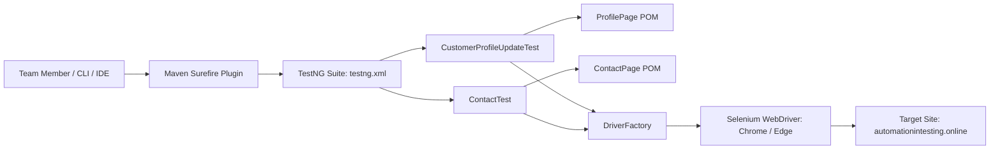

# Requirements

### Overview & Goals
The goal of this plan is to provide a step-by-step walkthrough and demonstration guide for running the Selenium WebDriver + TestNG automated testing framework against `https://automationintesting.online/` so team members can understand, execute, and verify the test suite.

### Scope
- **In Scope**:
  - Step-by-step environment verification (Java 17, Maven 3.8+, Chrome / Edge).
  - Executing all 13 automated tests across Customer Profile and Contact Form modules via CLI and IDE.
  - Running focused test executions (single test class, individual test method, cross-browser).
  - Locating, interpreting, and presenting TestNG / Maven Surefire test reports.
- **Out of Scope**:
  - Modifying existing application production code on the external website.
  - Adding non-Selenium/TestNG testing frameworks.

### User Stories
- **As a Test Engineer / Presenter**, I want a clear step-by-step execution procedure so that I can confidently demonstrate test suite automation and validation results to my team.
- **As a Team Member / Reviewer**, I want to observe test execution and review generated test reports so that I can verify application quality and test coverage.

### Functional Requirements
- Provide exact terminal/CLI commands for full suite and single-test execution.
- Detail IDE-based execution steps (IntelliJ IDEA / Eclipse) using TestNG plugin or Maven tool window.
- Provide instructions on inspecting test results in both console and generated HTML reports (`target/surefire-reports/index.html`).

# Technical Design

### Current Implementation
The repository contains a structured Selenium + TestNG framework using the Page Object Model (POM):
- `pom.xml`: Configured with Java 17, Selenium `4.24.0`, TestNG `7.10.2`, WebDriverManager `5.9.2`, and `maven-surefire-plugin` `3.2.5` pointing to `testng.xml`.
- `testng.xml`: Defines the suite `HotelBookingAutomationSuite` with classes:
  - `com.hotelbooking.CustomerProfileUpdateTest` (3 test scenarios)
  - `com.hotelbooking.ContactTest` (10 test scenarios)
- `DriverFactory.java`: Centralized driver initialization supporting Chrome and Edge with headless execution.
- `ProfilePage.java` & `ContactPage.java`: Encapsulate element locators, dynamic wait conditions, form actions, and assertions.

### Step-by-Step Execution Guide

#### Step 1: Verify Prerequisites
Before running the tests, verify the following tools are installed:
1. **Java Development Kit (JDK 17+)**:
   ```bash
   java -version
   ```
2. **Apache Maven (3.8+)**:
   ```bash
   mvn -version
   ```
3. **Browser**: Google Chrome or Microsoft Edge installed.

#### Step 2: Run the Full Test Suite
To run all automated tests (13 test cases across all modules):
```bash
mvn clean test
```
- TestNG executes `testng.xml`.
- The terminal will display test progress and output a final `BUILD SUCCESS` summary.

#### Step 3: Run Specific Test Classes or Scenarios
- Run only Customer Profile tests:
  ```bash
  mvn test -Dtest=CustomerProfileUpdateTest
  ```
- Run only Contact Form tests:
  ```bash
  mvn test -Dtest=ContactTest
  ```
- Run a single specific test method:
  ```bash
  mvn test -Dtest=ContactTest#testValidContactFormSubmission
  ```
- Run specifically the Long Message test scenario:
  ```bash
  mvn test -Dtest=ContactTest#testLongMessageSubmission
  ```

#### Step 4: Run on Microsoft Edge
By default, tests run on Chrome. To demonstrate cross-browser capability on Microsoft Edge:
```bash
mvn test -Dbrowser=edge
```

#### Step 5: Running from IDE (IntelliJ IDEA / Eclipse)
1. Right-click on `testng.xml` -> **Run 'testng.xml'**.
2. Or right-click any test class (`ContactTest.java` / `CustomerProfileUpdateTest.java`) -> **Run 'ContactTest'**.
3. View real-time test tree execution in the IDE Test Runner tab.

#### Step 6: Present Test Reports to Team Members
After execution, demonstrate test results using the generated artifacts in `target/surefire-reports/`:
- **HTML Report**: Open `target/surefire-reports/index.html` or `target/surefire-reports/emailable-report.html` in any browser.
- **Summary Text**: View `target/surefire-reports/TestSuite.txt`.

### Architecture Diagram


# Testing

### Validation Approach
Demonstration and validation are verified through two primary mechanisms:
1. **Console Execution Output**: Verifying clean builds with zero failures/errors.
2. **TestNG Report Verification**: Reviewing generated HTML/XML test artifacts.

### Key Scenarios Covered in the Demo
1. **Customer Profile Workflow (3 Scenarios)**:
   - Updating profile fields (Address, City, Phone) with valid data.
   - Persistence check after navigating away and returning.
   - Form error validation when mandatory fields are cleared and submitted.
2. **Contact Form Workflow (10 Scenarios)**:
   - Valid contact form submission and confirmation message.
   - Empty field validations (Name, Email, Phone, Subject, Description).
   - Invalid format validations (invalid email, invalid phone length).
   - Completely empty form submission validation.
   - Special characters and long description handling.

### Expected Demonstration Results
- **Total Tests**: 13
- **Expected Status**: 13 Passed, 0 Failed, 0 Skipped
- **Report Path**: `target/surefire-reports/index.html`

# Delivery Steps

### ✓ Step 1: Verify prerequisites and environment setup
The local environment is validated with all required Java, Maven, and browser dependencies ready for execution.

- Check Java JDK installation and version (`java -version`, requiring Java 17+).
- Check Apache Maven installation and version (`mvn -version`, requiring Maven 3.8+).
- Ensure Google Chrome and/or Microsoft Edge are installed on the demo machine.
- Verify that the target website `https://automationintesting.online/` is accessible over the network.

### ✓ Step 2: Execute and demonstrate the full TestNG test suite
The complete automated test suite runs end-to-end via Maven and TestNG, executing all 13 test cases.

- Open a terminal or PowerShell in the project root `hotel-booking-automation-testing`.
- Run `mvn clean test` to compile project sources and trigger the TestNG suite (`testng.xml`).
- Walk the team through the console output showing execution progress across `CustomerProfileUpdateTest` (3 tests) and `ContactTest` (10 tests).
- Highlight the final build summary confirming `BUILD SUCCESS` with 0 failures and 0 errors.

### ✓ Step 3: Demonstrate targeted tests and cross-browser execution
Individual test classes, specific test methods, and alternative browser configurations are demonstrated to the team.

- Execute only the Customer Profile suite using `mvn test -Dtest=CustomerProfileUpdateTest`.
- Execute only the Contact Form suite using `mvn test -Dtest=ContactTest`.
- Demonstrate a specific single test case (e.g., `mvn test -Dtest=ContactTest#testValidContactFormSubmission`).
- Run the test suite on Microsoft Edge browser using `mvn test -Dbrowser=edge`.
- Explain how `DriverFactory.java` configures browser options and headless execution.

### ✓ Step 4: Review and present test reports to team members
Test results, HTML reports, and log files are inspected and explained to the team.

- Navigate to `target/surefire-reports/` to inspect execution artifacts.
- Open `target/surefire-reports/index.html` or `emailable-report.html` in a web browser to present the visual TestNG report.
- Review `target/surefire-reports/TestSuite.txt` showing summary metrics (Tests run, Failures, Errors, Execution time).
- Demonstrate how failure assertions and error details would appear if a validation fails.